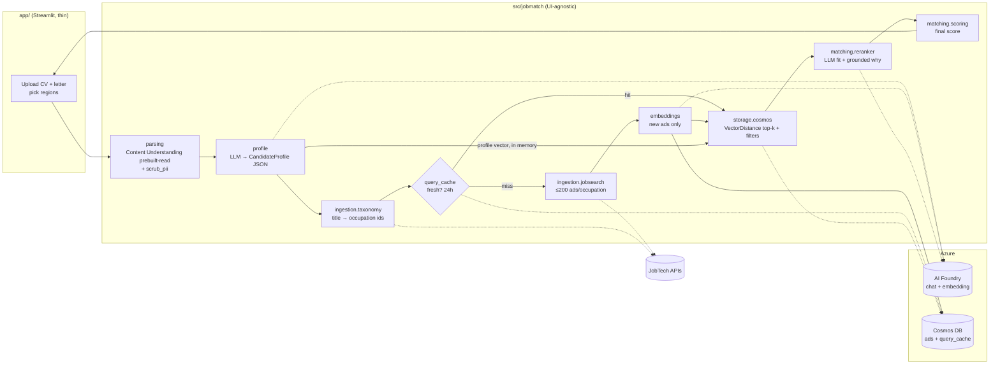

# JobMatch: project guide

CV ↔ Swedish job-ad matcher. RAG on Azure AI Foundry and Cosmos DB for NoSQL. **3-day MVP.**

**Assumptions** (fix them if they're wrong):
- 4 people (if you're 3, merge role D into A and B).
- Azure for Students credits, one subscription, and one person with Owner rights.
- Azure region **Sweden Central**.
- Local demo only, with `uv` as the package manager.
- Explanations in English, with Swedish as a toggle.

**Verified live on 2026-10-07** (not just from docs):
- The JobSearch API needs **no API key**.
- `limit` ≤ 100 and `offset` ≤ 2000.
- Exact-label lookups in the Taxonomy API often miss. `Mjukvaruutvecklare` and `Data engineer` return nothing.
- Taxonomy latency swings between 0.1 s and over 20 s.

The starter code already handles all of the above.

---

## 1. Architecture overview



### Key decisions

| Decision | Choice | Why |
|---|---|---|
| CV text extraction | **Azure Content Understanding `prebuilt-read`** (API 2025-11-01, SDK `azure-ai-contentunderstanding`, `begin_analyze_binary`) with the local pypdf/python-docx parser as fallback | It handles scanned and photo CVs (OCR, Swedish supported) and needs no LLM deployment. Bytes go straight from memory, so nothing is stored in Blob. Same Foundry resource and region (Sweden Central). Issue #1. |
| Primary source | **JobSearch API** (live ads) | Historical ads have dead apply links. Use Historical only for an offline eval set and load testing. |
| Query mapping | LLM outputs **Swedish** Platsbanken titles → Taxonomy `occupation-name` ids → JobSearch `occupation-name=…`. Falls back to free-text `q`. | Taxonomy ids are precise and language-independent. The fallback is required because exact-label coverage is spotty (verified). |
| Chat model | `gpt-4.1-mini` (config-driven) | Supports structured outputs, handles Swedish well, is cheap and fast. Check its retirement date in Foundry. Swap to `gpt-5-mini` (low reasoning effort) by changing one env var. |
| Embedding model | `text-embedding-3-small`, 1536 dims | Good multilingual (Swedish) quality at about $0.02 per 1M tokens. Upgrading to `-large` means re-embedding everything, so decide on day 1. |
| Chunking | **None.** One vector per ad and one per profile. | Ads and profiles are short whole-document "intents". Chunking adds max-pooling logic for no MVP gain. Ads are truncated to the first 4,000 characters, where the role and requirements live. |
| What gets embedded for the CV | The **LLM profile rendered in "ad shape"** (`Titel / Krav / Erfarenhet / summary`), **not** the raw CV | This is your biggest weak spot. A raw CV vector is dominated by names, education and layout noise, and matches ads poorly (an asymmetric-retrieval problem). Mirroring the ad template puts the query and documents in the same part of the vector space. It also means no direct PII goes into the vector. |
| Retrieval scope | Vector search over **all live cached ads** (+ region filter), not only this query's pool | Adjacent roles from earlier searches surface "for free", and results improve as the cache grows. |
| Re-ranking | One batched LLM call for the top-N (N = 10) above the threshold | Bounds cost and latency. If p95 goes over 20 s, switch to parallel per-ad calls. |
| Grounding | Structured output with verbatim `cv_evidence`/`ad_evidence` quotes, then a **substring check** in code drops any quote not found in the source | This is a cheap, deterministic way to catch hallucinations. It's `matching.scoring.grounded_quotes`. |
| Scoring | `final = 100·(0.6·fit/100 + 0.4·norm(sim))` where `norm(sim) = clip((sim − 0.30)/(0.75 − 0.30), 0, 1)`. Ads the LLM didn't review get only the similarity term, so they rank below. | LLM fit reads hard requirements. Similarity stabilises the LLM's tendency to cluster scores around 70–85. **Calibrate 0.30 and 0.75 on day 2** using the score histogram. |
| Cache | `query_cache` doc keyed on `source + sorted occupation ids + normalised text + sorted regions`, with container TTL 24 h. Ads are deduped by `id = "jobsearch:<id>"`. Per-ad TTL = deadline + 1 day. | TTL deletes stale data automatically with no cron job. Existing ads are never re-embedded. |
| Layering | `pipeline.MatchService.match()` is the only thing the UI calls, and it returns a Pydantic `MatchReport` | FastAPI later becomes `@app.post("/match")` wrapping the same call, so no core logic gets rewritten. |

---

## 2. Azure setup checklist

**Owner:** person D, done by **11:00 on day 1**. Share keys via a private channel. Never put them in the repo.

| # | Step | Detail |
|---|---|---|
| 1 | Resource group | `rg-jobmatch-dev` in **Sweden Central** (EU data residency, Swedish workloads) |
| 2 | Budget alert | Cost Management → Budget **$20/month** with alerts at 50/80/100 %. Do this first. |
| 3 | AI Foundry project | Create a Foundry **project** (this also creates the AI Services resource) in **Sweden Central**, which is a Content Understanding region. Copy the endpoint and key into `.env.local`. Content Understanding `prebuilt-read` uses the same resource and needs no model defaults. |
| 4 | Deploy chat model | `gpt-4.1-mini` with deployment name = model name. Pick **Data Zone Standard (EU)** if offered (processing stays in the EU), otherwise Standard. Start at 50k TPM. |
| 5 | Deploy embedding model | `text-embedding-3-small`, same deployment type, 100k+ TPM (prewarm embeds about 1,000 ads in bursts) |
| 6 | Cosmos DB account | API **NoSQL**. Apply **Free Tier** (1,000 RU/s + 25 GB free, one per subscription). If Free Tier is taken, use **Serverless**. |
| 7 | Enable vector search | Cosmos account → **Features → "Vector Search for NoSQL API" → Enable** (or `az cosmosdb update --capabilities EnableNoSQLVectorSearch`). This can take up to 15 min, and **containers created before enabling it can't get a vector policy.** |
| 8 | Create schema | `uv run python scripts/init_cosmos.py` (idempotent) |
| 9 | Smoke test | `uv run python scripts/prewarm_cache.py` → check the Data Explorer for about 1k docs in `ads` |

### Cosmos container design (implemented in `storage/cosmos.py`)

| Container | Partition key | TTL | Indexing |
|---|---|---|---|
| `ads` | `/region_id` (`"unknown"` if missing) | `default_ttl = -1` (TTL on), per-item `ttl` = time to deadline + 1 day, capped at 60 days | Vector policy `/embedding` float32, cosine, 1536 dims. **`quantizedFlat`** vector index (switch to `diskANN` above about 50k ads). `/embedding/*` and `/description` are excluded from range indexing to save write RU. |
| `query_cache` | `/id` (hash of the cache key) | `default_ttl = 86400` | default |

**Why `/region_id`:** the most common filter is region, so filtered vector queries hit fewer partitions. The cardinality (21 län + "unknown") is fine at student scale. A logical partition can hold 20 GB, which is about a million ads.

The vector query (cosine `VectorDistance` returns a **similarity**, higher is better):

```sql
SELECT TOP 30 c.id, c.title, …, VectorDistance(c.embedding, @emb) AS similarity
FROM c
WHERE (NOT IS_DEFINED(c.deadline) OR IS_NULL(c.deadline) OR c.deadline >= @now)
  AND ARRAY_CONTAINS(@regions, c.region_id)
ORDER BY VectorDistance(c.embedding, @emb)
```

Note: below about 1,000 vectors, `quantizedFlat` falls back to a brute-force scan. Results are still correct, just more RU.

### Keeping costs low

- **Embeddings are nearly free.** 2,000 ads × about 800 tokens is roughly 1.6M tokens, or about $0.03.
- **The chat model is the main cost.** A search uses about 16k input and 3.5k output tokens, which is roughly 1 cent with gpt-4.1-mini. 500 demo searches cost about $5. *(Check current Azure prices.)*
- Free-tier Cosmos with 2 containers at 400 RU/s each stays within the free 1,000 RU/s. **Don't** set throughput above 1,000 in total. Serverless bills only per request.
- Use `scripts/prewarm_cache.py` once and let the 24 h cache absorb repeat searches.
- Never put an un-throttled app on the public internet (see §9).
- Delete the resource group after grading, or scale it down.

---

## 3. Three-day plan

**Roles:**
- **A**: Ingestion & cache
- **B**: Storage, embeddings & retrieval
- **C**: LLM (profile, re-rank, prompts, eval)
- **D**: Azure, UI & integration (also the "demo owner")

| | A: Ingestion | B: Storage/Retrieval | C: LLM | D: Infra/UI |
|---|---|---|---|---|
| **Day 1 AM** | Run smoke script. Harden JobSearch client and tests. | Read Cosmos vector docs. Review `storage/cosmos.py`. | Write 3–5 **fictional** CVs (different roles and seniority). | Azure setup §2 steps 1–8. Share `.env.local` privately. |
| **Day 1 PM** | Taxonomy mapping + free-text fallback. Cache-key tests. | `init_cosmos`, upsert, vector query on 200 real ads | Profile extraction prompt on the sample CVs, iterated until the JSON looks right | Streamlit renders a **mocked** `MatchReport` (fixture JSON) |
| **🔗 Day 1 EOD** | **Integration 1:** `prewarm_cache.py` fills Cosmos, and a hard-coded profile text returns sensible ads from vector search | | | |
| **Day 2 AM** | `CandidatePool.refresh` with cache hit/miss logging. Prewarm 5–8 roles. | Region and remote filters. `count_live_ads`. Score histogram data. | Re-rank prompt + grounding check. Test on 10 real ads. | Wire UI to `MatchService.match()`. Error states (bad PDF, no hits). |
| **🔗 Day 2 noon** | **Integration 2:** a full end-to-end run on one sample CV | | | |
| **Day 2 PM** | Edge cases: no taxonomy hit, Taxonomy timeout, 0 ads | **Calibrate** `MIN_SIMILARITY` and the ceiling from histograms across all sample CVs | Explanation language toggle. Prompt tightening against hallucinated skills. | Summary metrics + chart. Apply links. Spinner text. |
| **Day 3 AM** | Latency pass: log timings per stage, prewarm demo roles | Fallback: show the top 5 as "weak matches" when fewer than 5 pass the threshold | Mini eval: 5 CVs × top 5, hand-labelled relevant/not, record precision@5 | README, demo script, screenshots |
| **Day 3 PM** | 13:00 **feature freeze** → bug fixes only. 15:00 **code freeze** → two full demo rehearsals on a clean clone. | | | |

**Demo-ready definition (all must be true at the end of day 3):**
1. A fresh clone → `uv sync` → `.env.local` → `streamlit run` works on **two** team laptops.
2. Uploading each of 3 sample CVs (PDF and DOCX) returns ≥ 5 ranked live ads in **< 30 s** cold and **< 15 s** warm.
3. Every LLM-explained card shows a score, an explanation, matched and missing skills, and a working **Apply** link to Platsbanken.
4. The summary shows ads searched, ads above the threshold and the score distribution.
5. No CV text appears in Cosmos, logs or the repo (checked by grepping logs and the Data Explorer).
6. `pytest -m "not live"` and `ruff` pass in CI on `main`.
7. A backup recording of the demo exists in case the Wi-Fi or Azure goes down.

---

## 4. GitHub board

**Milestones:**
- `M1 – Day 1: Foundations`
- `M2 – Day 2: End-to-end`
- `M3 – Day 3: Demo-ready`
- `Stretch`

Board columns: **Backlog → Ready → In progress → Review → Done**. WIP limit is 1 per person in progress.

| # | Title | Acceptance criteria | Labels | Est | Deps | MS |
|---|---|---|---|---|---|---|
| [#1](https://github.com/mike23s/RAG-Project-G2/issues/1) | Parse CV from PDF → Content Understanding `prebuilt-read` | PDF (incl. a scanned/image-only PDF), DOCX and PNG/JPG CVs return text; Bytes sent directly from memory — nothing written to disk or Blob; Local fallback used when `CONTENT_UNDERSTANDING_ENDPOINT` is unset; Extraction < 10 s for a 2-page CV; Checked: how long CU retains analysis results; note in docs/decisions.md (GDPR) | `parsing` | 3h | #2 | M1 |
| [#2](https://github.com/mike23s/RAG-Project-G2/issues/2) | Provision Azure resources | Budget alert ($20/mo) active; gpt-4.1-mini + text-embedding-3-small deployed (Data Zone EU if offered); Foundry resource is in a Content Understanding region (swedencentral); Cosmos 'Vector Search for NoSQL API' feature enabled BEFORE any container is created; Endpoints/keys shared privately, never in the repo | `infra` | 3h | – | M1 |
| [#3](https://github.com/mike23s/RAG-Project-G2/issues/3) | Local dev setup + pre-commit | Every member runs `uv run pytest -m 'not live'` green; Every member runs `scripts/smoke_jobsearch.py` and sees ads | `infra`, `docs` | 1h | – | M1 |
| [#4](https://github.com/mike23s/RAG-Project-G2/issues/4) | Harden JobSearch client | Fixture mapping test passes; Live test returns ≤ N ads; Paging never exceeds offset 2000 / limit 100 | `ingestion` | 2h | #3 | M1 |
| [#5](https://github.com/mike23s/RAG-Project-G2/issues/5) | Taxonomy occupation mapping | Mocked-HTTP tests: exact match, autocomplete, timeout → `()`; Taxonomy slowness never blocks a search for more than ~16 s | `ingestion` | 3h | #3 | M1 |
| [#6](https://github.com/mike23s/RAG-Project-G2/issues/6) | Region list from Taxonomy | `get_regions()` returns 21 entries; Cached for the process lifetime | `ingestion`, `ui` | 1h | #5 | M1 |
| [#7](https://github.com/mike23s/RAG-Project-G2/issues/7) | Cosmos schema script | Both containers visible in portal with vector policy + TTL; Script is idempotent | `storage`, `infra` | 2h | #2 | M1 |
| [#8](https://github.com/mike23s/RAG-Project-G2/issues/8) | Embedding service | 150 texts → 150 vectors of len 1536, order preserved; 429s retried, not crashed | `embeddings` | 2h | #2 | M1 |
| [#9](https://github.com/mike23s/RAG-Project-G2/issues/9) | Ad upsert + vector search | 200 real ads stored with per-item ttl; Query returns top-k sorted by similarity; Region filter works | `storage`, `retrieval` | 4h | #7, #8 | M1 |
| [#10](https://github.com/mike23s/RAG-Project-G2/issues/10) | Sample fictional CVs | Files in `data/samples/`; No real people or real contact details | `docs`, `llm` | 2h | – | M1 |
| [#11](https://github.com/mike23s/RAG-Project-G2/issues/11) | Profile extraction | Valid profile for every sample CV; Occupations are Platsbanken-style Swedish titles; No PII in the output | `llm` | 4h | #2, #10, #1 | M1 |
| [#12](https://github.com/mike23s/RAG-Project-G2/issues/12) | Streamlit shell with mock data | Cards, metrics and score chart render offline | `ui` | 3h | – | M1 |
| [#13](https://github.com/mike23s/RAG-Project-G2/issues/13) | Prewarm script | ~1k ads in Cosmos after first run; Second run embeds 0 new ads | `ingestion`, `embeddings` | 1h | #9 | M1 |
| [#14](https://github.com/mike23s/RAG-Project-G2/issues/14) | Candidate pool with cache | Repeat search within 24 h makes 0 JobSearch calls (logged); Cache key normalised (order/case-insensitive) | `ingestion`, `storage` | 3h | #9, #5 | M2 |
| [#15](https://github.com/mike23s/RAG-Project-G2/issues/15) | Re-rank + grounded explanations | Top 10 explained; Unknown ad_ids dropped; Grounding check removes invented quotes (unit test) | `llm`, `retrieval` | 4h | #11, #9 | M2 |
| [#16](https://github.com/mike23s/RAG-Project-G2/issues/16) | Wire pipeline end to end | Sample CV → ≥ 5 matches; Stage timings logged (no CV text in logs) | `retrieval` | 3h | #14, #15 | M2 |
| [#17](https://github.com/mike23s/RAG-Project-G2/issues/17) | UI on the real pipeline | Upload → results; Friendly errors: unreadable file, 0 hits, Azure errors | `ui` | 3h | #12, #16 | M2 |
| [#18](https://github.com/mike23s/RAG-Project-G2/issues/18) | Calibrate threshold and scoring | Values + reasoning recorded in `docs/decisions.md` | `retrieval` | 2h | #16 | M2 |
| [#19](https://github.com/mike23s/RAG-Project-G2/issues/19) | Region / remote filters | Picking Skåne returns only Skåne ads | `retrieval`, `ui` | 2h | #16 | M2 |
| [#20](https://github.com/mike23s/RAG-Project-G2/issues/20) | Explanation language toggle | Explanation language follows the toggle | `llm`, `ui` | 1h | #15 | M2 |
| [#21](https://github.com/mike23s/RAG-Project-G2/issues/21) | PII review | PR checklist completed; Grep of logs + Cosmos Data Explorer shows no CV text; Scrubber tests extended | `infra`, `llm` | 2h | #16 | M3 |
| [#22](https://github.com/mike23s/RAG-Project-G2/issues/22) | Stage timing + latency fixes | Warm search < 15 s on demo laptops; Cold search < 30 s | `retrieval` | 3h | #16 | M3 |
| [#23](https://github.com/mike23s/RAG-Project-G2/issues/23) | Weak-match fallback | Never an empty results page for a valid CV | `retrieval`, `ui` | 1h | #18 | M3 |
| [#24](https://github.com/mike23s/RAG-Project-G2/issues/24) | Mini evaluation | precision@5 recorded in `docs/eval.md` | `llm`, `docs` | 3h | #16 | M3 |
| [#25](https://github.com/mike23s/RAG-Project-G2/issues/25) | README + demo script | A newcomer runs the app from the README alone | `docs` | 2h | #17 | M3 |
| [#26](https://github.com/mike23s/RAG-Project-G2/issues/26) | Demo rehearsal + recording | Backup recording saved; Known issues listed | `docs` | 2h | #25 | M3 |
| [#27](https://github.com/mike23s/RAG-Project-G2/issues/27) | Personal letter as matching signal | A/B on 3 CVs documented | `llm` | 3h | #16 | Stretch |
| [#28](https://github.com/mike23s/RAG-Project-G2/issues/28) | Cover-letter draft for a chosen ad | No invented experience (grounding check) | `llm`, `ui` | 4h | #15 | Stretch |
| [#29](https://github.com/mike23s/RAG-Project-G2/issues/29) | Skill-gap overview | Top 10 missing skills shown as a chart | `ui` | 2h | #15 | Stretch |
| [#30](https://github.com/mike23s/RAG-Project-G2/issues/30) | Hybrid search (full-text + vector, RRF) | Beats vector-only precision@5 on the eval set | `retrieval` | 4h | #24 | Stretch |
| [#31](https://github.com/mike23s/RAG-Project-G2/issues/31) | Historical-ads evaluation set | 30+ pairs; Script reports precision@k and nDCG | `llm`, `docs` | 4h | #24 | Stretch |

> The board lives on GitHub: [issues](https://github.com/mike23s/RAG-Project-G2/issues) and [milestones](https://github.com/mike23s/RAG-Project-G2/milestones). It is the source of truth; this table is a snapshot from 2026-10-07. Add the issues to a GitHub **Project** (Board view) for the columns.

---

## 5. Repository structure

```
RAG-Project-G2/
├── pyproject.toml                 # deps, ruff + pytest config (uv-managed)
├── .env.example                   # every setting documented, no secrets
├── .env.local                     # YOUR secrets (git-ignored, create from example)
├── .pre-commit-config.yaml        # ruff, ruff-format, gitleaks, large-file guard
├── .github/
│   ├── workflows/ci.yml           # lint + offline tests on every push/PR
│   └── pull_request_template.md   # PR checklist incl. PII check
├── README.md                      # quick start + layout
├── docs/
│   ├── GUIDE.md                   # this file
│   ├── decisions.md               # (create) ADR-style log: threshold, model choices…
│   └── eval.md                    # (create) evaluation method + results
├── src/jobmatch/
│   ├── config.py                  # pydantic-settings Settings, get_settings()
│   ├── models.py                  # domain models: CandidateProfile, JobAd, Match, MatchReport…
│   ├── pipeline.py                # MatchService.match(): the ONLY entry point for UIs
│   ├── ingestion/
│   │   ├── base.py                # JobSource protocol + AdQuery (also builds cache keys)
│   │   ├── jobsearch.py           # JobSearch client + hit → JobAd mapping
│   │   └── taxonomy.py            # title → occupation ids, region list (timeouts → fallback)
│   ├── parsing/
│   │   ├── extract.py             # PDF/DOCX/TXT bytes → text, in memory
│   │   └── pii.py                 # regex scrub: email, phone, personnummer, URLs
│   ├── profile/extractor.py       # CV text → CandidateProfile via structured outputs
│   ├── embeddings/service.py      # batched embeddings + "what to embed" templates
│   ├── storage/cosmos.py          # schema, query cache, ad upsert, vector search
│   ├── retrieval/candidates.py    # cache-aware pool refresh: query → fetch → embed → store
│   ├── matching/
│   │   ├── scoring.py             # pure functions: normalise, final score, grounding check
│   │   └── reranker.py            # LLM re-rank + explanations for top-N
│   └── llm/
│       ├── client.py              # shared OpenAI client → Foundry v1 endpoint
│       └── prompts.py             # all prompts, versioned together
├── app/streamlit_app.py           # thin UI over MatchService
├── scripts/
│   ├── init_cosmos.py             # create DB/containers (idempotent)
│   ├── prewarm_cache.py           # fetch + embed demo roles ahead of time
│   └── smoke_jobsearch.py         # check JobTech APIs with no Azure needed
├── tests/                         # pytest; fixtures/; `-m live` = real API calls
└── data/samples/                  # FICTIONAL CVs only
```

---

## 6. Starter code

It's all in the repo and verified as follows:
- `ruff` is clean and `pytest` passes 9/9, including a live JobSearch test.
- The smoke script returns real ads.
- Streamlit boots.
- The Azure calls are untested until you have keys.

| What | Where |
|---|---|
| Dependencies | `pyproject.toml` (use `uv sync --extra dev`; `pip install -e ".[dev]"` also works) |
| Settings | `src/jobmatch/config.py`. Azure fields are optional at load time and checked with `require()` where they're used, so ingestion work needs no keys. |
| Env template | `.env.example` |
| JobSearch client | `src/jobmatch/ingestion/jobsearch.py` |
| Cosmos repository + vector query | `src/jobmatch/storage/cosmos.py` |
| Embedding service | `src/jobmatch/embeddings/service.py` |
| Matcher | `src/jobmatch/matching/` + `src/jobmatch/pipeline.py` |
| Streamlit page | `app/streamlit_app.py` |

**`.env.local` rules:**
- Copy `.env.example` to `.env.local`.
- Fill in `AZURE_OPENAI_ENDPOINT`, `AZURE_OPENAI_API_KEY`, `COSMOS_ENDPOINT` and `COSMOS_KEY`.
- It's git-ignored, and `gitleaks` in pre-commit is the second line of defence.
- Share values through a private channel, never in an issue or PR.
- If a key leaks, rotate it in the portal right away.

**The Foundry endpoint:** the code uses the OpenAI-compatible **v1** endpoint (`{endpoint}/openai/v1/`, no `api-version`) with the plain `OpenAI` client. If your resource only accepts the older style, swap in `AzureOpenAI(azure_endpoint=…, api_version="2024-10-21")` in `llm/client.py`. Nothing else changes.

---

## 7. Conventions

- **Branching:** `main` is protected (PR + 1 approval + green CI). Branches are named `feat/<issue#>-short-slug`, `fix/…` or `docs/…`, live for less than a day, and get **squash-merged**. Rebase on `main` before opening a PR.
- **Commits / PR titles:** Conventional Commits (`feat(retrieval): add region filter (#19)`). Every PR links an issue with `Closes #N`.
- **Style:** **ruff for both linting and formatting** (it replaces black and isort, one tool, faster). Line length is 100. Use type hints on public functions. Pydantic models cross module boundaries, not dicts.
- **Rules:**
  - `app/` contains no business logic.
  - Prompts live only in `llm/prompts.py`.
  - Don't `print` or log CV text. Log ids, counts and timings only.
- **Pre-commit:** `uv run pre-commit install` once per clone.
- **Run locally:** see the README Quick start.
- **Daily rhythm:** 09:00 15-minute stand-up on the board. Integration checkpoints are fixed times from §3. 16:30 merge window.

---

## 8. Risks and mitigations

| Risk | Impact | Mitigation |
|---|---|---|
| **JobTech API changes, limits or outages** | Demo breaks | No key is needed today, but the CORS headers still allow `api-key`, so it could come back (`JOBTECH_API_KEY` is already supported). No rate limit is documented, so be polite: the cache plus about 200 ads per query. **Prewarm before the demo**, since vector search over cached ads works even if JobSearch is down. |
| **Taxonomy API slow or poor coverage** | Searches time out or miss | Verified as erratic. There's an 8 s timeout and 1 retry, then a free-text fallback. Results are cached per process. Don't blindly broaden via Taxonomy relations: one tested relation pointed to an unrelated group. |
| **Ads removed before their deadline** | Dead Apply links | TTL limits staleness. Stretch: sync removals via the JobStream API, or check `removed` on display. |
| **Swedish text and embedding quality** | Poor ranking | `text-embedding-3` is multilingual. Embed both Swedish and English titles in the profile text. Use structured fields first in the ad text. Calibrate the threshold on real score distributions. Stretch: hybrid full-text search. |
| **LLM cost and latency** | Slow demo, burned credits | Top-N = 10 only, one batched call, `temperature=0`. CV and ads truncated. Budget alert. Prewarm. Stage timings logged (#22). |
| **Hallucinated skills or explanations** | Loss of trust | Grounding rules in the prompt, verbatim evidence plus substring check, and the eval set (#24). |
| **GDPR / PII** | Legal and ethical risk | Content Understanding receives the CV bytes: keep it in an EU region and check how long it retains analysis results (#1). The CV is processed **in memory only** (`getvalue()` bytes, no temp files). It's regex-scrubbed before any LLM call, never stored or logged, and the vector isn't persisted. Use an EU region with a Data Zone EU deployment (Azure OpenAI doesn't train on prompts, but check the abuse-monitoring retention terms). Use only fictional CVs in the repo. Add a one-line privacy notice in the UI (already there). Real CVs go only in git-ignored `data/private/`, deleted after the course. |
| **Scope creep** | No demo | Stretch issues can't start until items 1–5 of the demo-ready definition pass. Feature freeze is at 13:00 on day 3. The demo owner (D) has veto power. |
| **Azure quota or region issues** | Day 1 blocked | Start setup at 09:00. If gpt-4.1-mini isn't available in Sweden Central, use another EU region with the same data zone. Ingestion and UI work need no Azure (mock fixtures). |

---

## 9. Path to a live web app

1. **API:** a FastAPI app with `POST /match` (multipart CV) that calls `MatchService.match()` and returns `MatchReport`, giving free OpenAPI docs. Make the I/O async (`httpx.AsyncClient`, async Cosmos and OpenAI clients) and stream re-rank results with SSE.
2. **Front-end:** React/Next.js (or Vite + React) consuming the OpenAPI types. Streamlit stays as an internal debug tool.
3. **Ingestion as a job:** move fetching out of the request path. A nightly Azure Container Apps **Job** syncs ads via JobStream, so user requests only embed the profile and query. This gives much lower latency.
4. **Hosting:** Azure Container Apps (scale-to-zero, cheap) with an image in ACR, deployed by a GitHub Actions workflow.
5. **Security:**
   - **Managed Identity** with Cosmos data-plane RBAC and Foundry RBAC, so there are no keys.
   - Key Vault for any remaining secrets.
   - **Per-IP/user rate limiting** and a daily spend cap, because a public LLM endpoint is a cost attack surface.
   - CAPTCHA on uploads.
6. **Auth (optional):** Entra External ID or GitHub OAuth for saved searches. Even then, store only the *profile JSON* with explicit consent and a delete button, never the CV.
7. **Observability:** Application Insights through OpenTelemetry (latency per stage, token usage, error rates), with alerts on cost and 5xx. Track match click-through as a quality signal.
8. **Compliance:** a privacy policy, data-flow documentation, a short DPIA, and a check of JobTech's terms of use and attribution requirements for re-publishing ad content.

---

## Open questions (we're not blocked on these, the defaults above apply)

1. **Azure access:** is it one shared Azure for Students subscription with one Owner, or individual ones? This decides who does §2 and whether Free Tier Cosmos is still available.
2. **Course requirements:** does the course require specific Foundry features (Prompt Flow, Foundry evaluations, Agent Service) that should replace parts of this design?
3. **Audience language:** should the demo and explanations default to Swedish or English?
